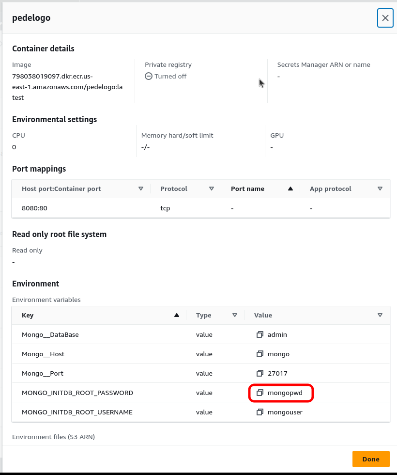
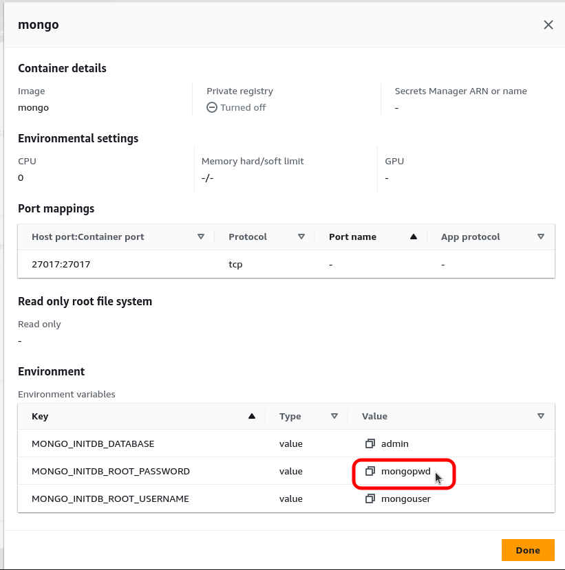
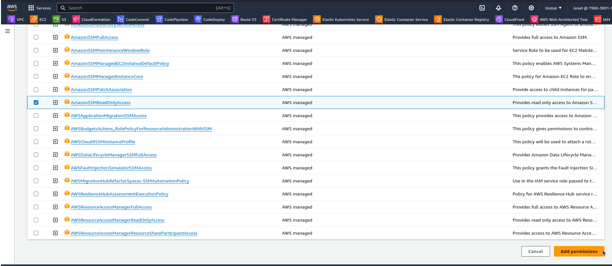

# Variáveis de ambientes seguras no AWS ECS com Systems Manager Parameter Store.

Em ambientes de produção, é fundamental evitar a exposição direta de senhas e informações confidenciais. Uma prática mais segura é utilizar o **Parameter Store**, uma das muitas funções do **AWS Systems Manager** para gerenciar e fornecer de maneira segura as variáveis de ambiente necessárias, garantindo a proteção adequada dos dados sensíveis durante a execução das tarefas no ECS. Essa abordagem não apenas fortalece a segurança, mas também demonstra um comprometimento sólido com as melhores práticas de gerenciamento de segredos em ambientes de nuvem. Ao adotar essa estratégia, não apenas otimizamos a segurança, mas também fortalecemos o perfil profissional, evidenciando uma compreensão aprofundada das práticas avançadas no contexto do AWS ECS e Systems Manager. #AWS #ECS #SystemsManager #SegurançaEmNuvem #DevOps #CloudComputing

## AWS ECS
O Amazon Elastic Container Service (ECS) é um serviço de orquestração de contêineres da Amazon Web Services (AWS) que simplifica o gerenciamento e a execução de aplicativos contêinerizados. Com o ECS, os desenvolvedores podem empacotar suas aplicações em contêineres, como Docker, e implantá-las de maneira escalável e eficiente na nuvem AWS.

O ECS oferece um ambiente altamente flexível, permitindo que os usuários criem e gerenciem clusters para hospedar seus contêineres. Ele integra-se perfeitamente com outros serviços AWS, proporcionando uma experiência integrada para escalabilidade automática, monitoramento, armazenamento e segurança.

Ao empregar definições de tarefas e serviços, o ECS permite a configuração precisa de como os contêineres devem ser executados e escalados. Isso simplifica a orquestração de aplicativos distribuídos, garantindo alta disponibilidade e eficiência operacional.

Além disso, o ECS é compatível com o AWS Fargate, que elimina a necessidade de provisionar e gerenciar infraestrutura, permitindo que os desenvolvedores se concentrem apenas na lógica de aplicação e na criação de contêineres. Com uma integração sólida com outros serviços AWS, o ECS emerge como uma solução robusta para implantar, gerenciar e escalar aplicativos contêinerizados na nuvem.

## Systems Manager

O AWS Systems Manager é uma solução abrangente que simplifica a gestão operacional de recursos na infraestrutura da AWS. Projetado para oferecer maior visibilidade, controle e automação, o Systems Manager oferece uma variedade de recursos que capacitam os administradores a manter a saúde e a conformidade dos sistemas, além de simplificar tarefas operacionais rotineiras.

Com o Systems Manager, os usuários podem gerenciar configurações, automatizar atualizações de software, coletar e analisar dados operacionais, bem como realizar operações de manutenção em larga escala. Um dos recursos notáveis é o **Parameter Store**, que permite armazenar e gerenciar de maneira segura informações confidenciais, como senhas e chaves, sendo uma escolha ideal para a gestão segura de variáveis de ambiente.

Ao integrar o Systems Manager com o Amazon ECS, os desenvolvedores podem alcançar um gerenciamento mais seguro e eficiente das variáveis de ambiente, assegurando a proteção adequada de informações sensíveis durante a execução de contêineres. Esta integração não apenas fortalece a segurança, mas também simplifica a administração operacional, proporcionando um ambiente robusto e confiável para os aplicativos na nuvem AWS.

##

**Vamos ao que interessa**

Ao criar uma definição de tarefa (task definition) no Amazon Elastic Container Service (ECS) da AWS, é essencial garantir a segurança na transmissão de variáveis de ambiente para os containers. Uma prática recomendada para lidar com informações sensíveis, como credenciais de banco de dados, é utilizar o AWS Systems Manager Parameter Store.

No tutorial em questão, supomos a existência de um cluster ECS devidamente configurado, com as tasks definitions contendo valores de senhas em texto claro. No entanto, essa abordagem pode representar uma vulnerabilidade de segurança, uma vez que expõe informações sensíveis para quem tem acesso ao ECS.

**Cluster ECS**

**Task Definitions**

Entrando nas configurações dos containers podemos verificar nas variáveis de ambiente a senha sendo exibida de forma text clean.

**Definições da Aplicação**

**Definições do Banco**

Vamos corrigir esse problema...

Na console da AWS pesquise por Systems Manager.

Em Systems Manager, na barra lateral procure em Aplication Management selecioene **Parameter Store** e depois clique no botão **Create parameter**

Em create parameter, vamos dar um nome para o novo parametro. No nosso caso vamos chama-lo de **"mongo-pwd"** e também selecione o tipo **secureString**

No campo **value** vamos digitar a senha que queremos guardar.

Observe que ao terminar de digitar a senha ela será transformada em asteriscos.

Vá até o final da página e clique em **create parameter**

Se você entrar novamente no parâmetro que acabamos de criar, irá verificar que a senha fica criptografada. Porem se você é um usuário que tem permissão de criar parâmetros no parameter store, poderá ver qual o valor da senha clicando no botão **show decrypted value**

Voltando agora na tela do **Amazon Elastic Container Service (ECS)**, vamos clicar na **task definitions** existente.

Agora selecione a task e vamos criar uma nova versão com a atualização que queremos.

Na tela da nova versão da Task definitions procure as variáveis de ambiente dos containers que queremos modificar.

Nos campos **Value type** dos parâmetros das senhas, modifique para **ValueFrom** e no campo **value** modifique a senha em text clear para o nome que criamos em Parameter Store. conform mostrado nas imagens.

Com essas modificações a Task Definitions vai saber que tem que pegar o valor da Key no Systems Manager.

**ATENÇÃO!!!** Agora devemos dar a permissão para que o container possa conversar com o System Manager e poder resgatar o valor da senha.

Ainda na tela da nova verão da Task Definitions, procure por **Task execution role**

Pegue o nome da role no caso aqui  **ecsTaskExecutionRole**.

**OBS:** Essa role foi criado quando iniciamos um novo Cluster ECS. Caso não tenha não você terá que criar no IAM.

Pesquise em services por IAM.

Em IAM vá me **Roles** e pesquese por **ecsTaskExecutionRoles**, selecione e clique.

Ao cliar entramos nas propriedades da role. Agora clique em **Add permissions/Attach policies**

pesquise por **ssm**, selecione a policy **amazonSSMReadOnlyAccess** e depois clique no botão **Add permission**

Verifique que agora a role também está com a policy **amazonSSMReadOnlyAccess**

Volte para a tela do Task Definition e finalmente clique no botão **Create**

Na tela da nova revisão da Task vá no botão **Deploy** e escolha **Updaet service**

Na tela Update service vá até o final e clique no botão update.

Agora com a versão nova da Task definition criada, volta para a tela do Cluster ECS e clique no cluster. No meu caso o nome do cluster é **pedelogo**.

Vá em **Service** e clique no serviço.

Veja em Events que foi realizado a atualização do serviço.

Em Task definitions teremos uma nova verão da nossa task agora com as variáveis de ambientes seguras. Vamos entrar para confirmar se realmente está conforme queremos.

clique na nova versão.

Vá em containers e entre nas configurações do container.

Veja que agora estamos em conformidade coma segurança e não é mais exibido o valor da senha em texto claro.

Com isso finalizamos nosso pequeno artigo.

Espero que tenha gostado!!